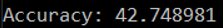

# Experiments

### only with rgb
 

 
 
-using only rgb we see good results with ‘rime’ and ‘dew’ but the accuracy is quite small compared to our final solution

### Only with hsv
 

 
 
-this is the result for hsv alone, we can see some good results regarding ‘rime’, ‘dew’, ‘fogsmog’, ‘lightning’
-the accuracy is pretty decent but there are a lot of images which are not predicted correctly. The results are not that bad

### Rgb and hsv
 

 
 
-the accuracy in this case is smaller than the previous case in which we tested only wich ‘hsv’, this is a little questionable but maybe when we work with such a lot of images and classes it’s a mixed blessing

### Onlty with frequency domain
 
 
-in this case there are a lot of wrong predictions and the accuracy is pretty small but we can see the ‘fogsmog’ and ‘frost’ classes are our cup of tea

If we mess around with radius we got other accuracy, here is the accuracy with radius = 50:

 
 
Radius = 100:

 
 
Radius = 150:

 
 
After some tests our conclusion is that the best accuracy is when we set the radius to 108.

### Final result
 
 
 
 
-our final result is combining hsv, rgb, and frequency domain
